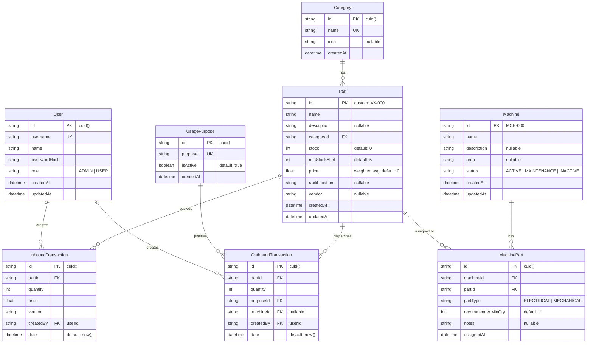

# PRD — Anvita System
## Sistem Manajemen Inventaris Suku Cadang Engineering

**Versi**: 1.1.0  
**Tim**: Engineering Department, PT Anvita Pharma Indonesia  
**Tanggal**: Juni 2026  
**Changelog**: Penambahan Modul Mesin, Sistem Autentikasi (Admin/User), dan peningkatan fitur bestehende.

---

## 1. Latar Belakang

Departemen Engineering PT Anvita Pharma Indonesia membutuhkan sistem digital untuk mengelola inventaris suku cadang (spare parts) yang digunakan dalam pemeliharaan dan perbaikan mesin produksi farmasi. Saat ini, pencatatan dilakukan secara manual yang menyebabkan:

- Keterlambatan identifikasi suku cadang yang habis/menipis
- Tidak ada visibilitas real-time terhadap stok fisik
- Kesulitan melacak riwayat pemakaian dan restock
- Tidak adanya laporan valuasi aset suku cadang secara otomatis
- Tidak ada pemetaan part ke mesin spesifik, sehingga saat breakdown mesin sulit mengetahui part mana yang relevan

## 2. Tujuan Produk

Membangun web application yang menjadi **single source of truth** untuk seluruh data inventaris suku cadang engineering, meliputi:

- **Pencatatan stok** suku cadang secara real-time
- **Tracking transaksi** barang masuk (inbound) dan keluar (outbound)
- **Alert otomatis** ketika stok mencapai batas minimum
- **Visualisasi dashboard** untuk monitoring operasional
- **Pemetaan part ke mesin** per kategori Electrical dan Mechanical
- **Autentikasi dua peran** (Admin & User) untuk kontrol akses yang tepat
- **Aksesibilitas** dari mana saja (remote/tunnel support)

## 3. Target Pengguna

| Persona | Role | Deskripsi | Hak Akses |
|---------|------|-----------|-----------|
| **Supervisor Engineering** | **Admin** | Manajer yang mengawasi ketersediaan part dan mesin | Akses penuh: semua menu + manajemen user + tambah/edit mesin + panel admin |
| **Admin Gudang** | **Admin** | Pengelola gudang suku cadang | Akses penuh: inventory, transaksi, mesin, admin panel |
| **Teknisi Lapangan** | **User** | Petugas yang mengambil part dari gudang | Akses terbatas: lihat dashboard, inventory (read-only stok), catat transaksi keluar, lihat daftar mesin |

### 3.1 Perbedaan Hak Akses Admin vs User

| Fitur | Admin | User |
|-------|-------|------|
| Dashboard | ✅ Full | ✅ Full (read-only) |
| Inventory — Lihat daftar part | ✅ | ✅ |
| Inventory — Tambah/Edit/Hapus part | ✅ | ❌ |
| Inventory — Export CSV | ✅ | ❌ |
| Transaksi Barang Keluar | ✅ | ✅ |
| Transaksi Barang Masuk | ✅ | ❌ |
| Mesin — Lihat daftar mesin & part | ✅ | ✅ |
| Mesin — Tambah/Edit/Hapus mesin | ✅ | ❌ |
| Mesin — Assign/Unassign part ke mesin | ✅ | ❌ |
| Panel Admin | ✅ | ❌ (menu tersembunyi) |
| Manajemen User | ✅ | ❌ |

## 4. Scope Produk (v1.1)

### ✅ Dalam Scope

| Modul | Fitur |
|-------|-------|
| **Autentikasi** | Login halaman, session management (JWT / cookie), dua peran Admin & User, halaman Manajemen User (Admin only) |
| **Dashboard** | Ringkasan metrik (Total SKU, Nilai Aset, Aliran Bulanan, Low Stock Count, Total Mesin Aktif), Grafik tren barang masuk/keluar, Top 4 suku cadang paling sering terpakai, Daftar kritis stok minimum, Log aktivitas terbaru, widget status mesin |
| **Data Barang (Inventory)** | Daftar seluruh suku cadang dengan filter & pencarian, Filter per kategori, lokasi rak, dan stok menipis, Paginasi, Export CSV (Admin), Riwayat transaksi per part, Generate label QR Code, badge indikasi part dipakai di mesin mana |
| **Transaksi In/Out** | Form pencatatan barang keluar (outbound) + referensi mesin opsional, Form pencatatan barang masuk (Admin only) dengan auto-detect Part ID baru, Kalkulasi harga rata-rata tertimbang (weighted average price) |
| **Mesin** | Daftar mesin produksi, Filter berdasarkan area/status, Detail mesin dengan dua tab: Electrical Parts & Mechanical Parts, Integrasi stok real-time dari Data Barang, Tambah/Edit/Hapus mesin (Admin only), Assign part ke mesin dengan quantity minimum yang direkomendasikan |
| **Panel Admin** | CRUD Kategori master, CRUD Tujuan Penggunaan, Import massal via CSV, Manajemen database, Manajemen User (CRUD akun, assign role) |

### ❌ Luar Scope (v1.1)

- Multi-gudang / multi-lokasi
- Purchase Order & Procurement
- Integrasi ERP/SAP
- Mobile native app
- Notifikasi email/push
- Single Sign-On (SSO)

## 5. Fitur Detail

### 5.1 Autentikasi & Sesi (`/login`, middleware)

**Halaman Login:**
- Input Username dan Password
- Tombol "Masuk"
- Pesan error: "Username atau password salah"
- Tidak ada registrasi mandiri — akun dibuat oleh Admin

**Manajemen Sesi:**
- Token disimpan di HTTP-only cookie (aman dari XSS)
- Durasi sesi: 8 jam (sesuai shift kerja)
- Auto-redirect ke `/login` jika sesi habis
- Tombol "Keluar" di header kanan atas

**Middleware Route Guard:**
- Semua halaman `/` ke bawah memerlukan autentikasi
- Halaman `/admin` dan sub-fitur admin ditandai "Admin only"
- Redirect ke `/403` jika user mengakses halaman yang tidak diizinkan

### 5.2 Dashboard (`/`) — Diperbarui

Dashboard menampilkan 6 section:

1. **Banner Selamat Datang** — Greeting dengan nama user yang login + jumlah item low-stock
2. **Kartu Metrik (5 KPI)**:
   - Total Item Suku Cadang (SKU terdaftar)
   - Nilai Total Aset Inventaris (Rp)
   - Barang Keluar Bulan Ini (kuantitas)
   - Peringatan Stok Minimum (jumlah item kritis)
   - **[BARU]** Total Mesin Terdaftar (jumlah mesin aktif)
3. **Grafik Batang Tren** — Perbandingan barang masuk vs keluar (rentang waktu: 7 hari, 30 hari, 3 bulan, 6 bulan, 1 tahun, semua)
4. **Donut Chart Top Outbound** — 4 suku cadang dengan frekuensi pemakaian tertinggi
5. **Panel Bawah Kiri** — Daftar kritis stok minimum + log aktivitas terbaru
6. **[BARU] Widget Status Mesin** — Ringkasan mesin dengan indikator part kritis (mesin mana yang punya part di bawah minimum)

### 5.3 Data Barang / Inventory (`/inventory`) — Diperbarui

Tabel inventaris dengan kolom:
- Part ID (`XX-000`)
- Nama Suku Cadang
- Kategori
- Stok Fisik (indikator "Low" jika ≤ min stock)
- Lokasi Rak
- Harga Satuan (Rp)
- **[BARU]** Dipakai di Mesin (badge jumlah mesin yang menggunakan part ini, clickable)
- Aksi: QR Code, Riwayat, Hapus (Hapus hanya Admin)

**Fitur pencarian & filter:**
- Search bar real-time (ID, nama, deskripsi)
- Dropdown filter kategori
- Dropdown filter lokasi rak
- Toggle filter stok menipis
- **[BARU]** Toggle filter "Dipakai di mesin" — hanya tampilkan part yang ter-assign ke minimal 1 mesin

**Aksi per baris (berbasis role):**
- **Admin**: QR Code | Riwayat | Edit | Hapus
- **User**: QR Code | Riwayat (read-only)

### 5.4 Transaksi In/Out (`/transactions`) — Diperbarui

#### Tab Barang Keluar (Outbound) — Tersedia untuk Admin & User
- Autocomplete search Part ID + nama
- Preview detail part (lokasi rak, harga, min stock)
- Input jumlah barang keluar
- Dropdown tujuan penggunaan
- **[BARU]** Dropdown opsional: "Digunakan untuk Mesin" — pilih mesin dari daftar
- Validasi: tidak boleh melebihi stok tersedia

#### Tab Barang Masuk (Inbound) — Admin only
- Input Part ID → auto-detect apakah ID sudah terdaftar
- Form registrasi part baru jika ID belum ada
- Input transaksi: jumlah masuk, harga beli satuan, vendor/supplier
- Kalkulasi weighted average price

### 5.5 Mesin (`/machines`) — **BARU**

#### 5.5.1 Daftar Mesin

Halaman utama `/machines` menampilkan grid/list seluruh mesin produksi:

**Kartu Mesin menampilkan:**
- Nama Mesin
- Kode Mesin (format: `MCH-001`)
- Area / Lokasi Mesin (misal: "Produksi Lantai 1", "Utility")
- Status Mesin: **Aktif** | **Maintenance** | **Tidak Aktif**
- Ringkasan part: total Electrical Part terdaftar, total Mechanical Part terdaftar
- Indikator peringatan: 🔴 jika ada part di bawah minimum stok

**Fitur:**
- Search bar (nama mesin, kode)
- Filter dropdown Area/Lokasi
- Filter dropdown Status
- Tombol "Tambah Mesin" — **Admin only** (tersembunyi untuk User)

#### 5.5.2 Detail Mesin (`/machines/[id]`)

Halaman detail menampilkan informasi lengkap sebuah mesin dengan **dua tab**:

**Header Detail Mesin:**
- Nama & Kode Mesin
- Area, Status, Deskripsi/catatan teknis
- Tombol Edit / Hapus — Admin only

**Tab 1: Electrical Parts**
- Tabel daftar part elektrik yang ter-assign ke mesin ini
- Kolom: Part ID | Nama Part | Stok Tersedia (real-time dari Data Barang) | Stok Minimum Direkomendasikan | Status Stok | Aksi
- Status Stok: ✅ Cukup | ⚠️ Menipis | 🔴 Kritis
- Tombol "Assign Part Elektrik" — Admin only

**Tab 2: Mechanical Parts**
- Struktur identik dengan tab Electrical Parts, untuk part mekanikal
- Tombol "Assign Part Mekanikal" — Admin only

**Modal Assign Part (Admin only):**
- Search & pilih Part ID dari Data Barang yang berkategori sesuai
- Input quantity minimum yang direkomendasikan untuk mesin ini
- Catatan tambahan (opsional)

#### 5.5.3 Logika Integrasi Stok

- Stok yang ditampilkan di detail mesin **selalu sinkron real-time** dari tabel `Part` di Data Barang
- Tidak ada duplikasi data stok — modul Mesin hanya menyimpan relasi `machine ↔ part` beserta `recommendedMinQty`
- Perubahan stok via Transaksi In/Out langsung tercermin di halaman detail mesin
- Jika sebuah Part dihapus dari Data Barang, relasinya ke mesin otomatis terhapus (cascade)

### 5.6 Panel Admin (`/admin`) — Diperbarui

4 section:

1. **Kelola Kategori Master** — Tambah/hapus kategori dengan pemilihan ikon visual
2. **Tujuan Penggunaan** — CRUD parameter dropdown barang keluar
3. **Import Data CSV** — Upload bulk data suku cadang
4. **Manajemen Database** — Seed dummy data / clear data
5. **[BARU] Manajemen User** — Daftar akun terdaftar, tambah user baru (isi username, nama, password, role), reset password, hapus user

---

## 6. Model Data — Diperbarui

**Model Baru:**
- `User` — akun pengguna dengan role ADMIN atau USER
- `Machine` — data master mesin produksi
- `MachinePart` — tabel relasi banyak-ke-banyak antara Machine dan Part, dengan atribut `partType` (ELECTRICAL/MECHANICAL) dan `recommendedMinQty`

**Field Baru di Model Existing:**
- `OutboundTransaction.machineId` — referensi mesin opsional saat pencatatan barang keluar
- `InboundTransaction.createdBy` & `OutboundTransaction.createdBy` — audit trail siapa yang mencatat transaksi

---

## 7. API Endpoints — Diperbarui

Total **38 endpoints** dalam Next.js API Routes:

### Auth *(BARU)*
| Method | Path | Deskripsi | Akses |
|--------|------|-----------|-------|
| POST | `/api/auth/login` | Login, return session token | Public |
| POST | `/api/auth/logout` | Hapus session | Authenticated |
| GET | `/api/auth/me` | Info user yang sedang login | Authenticated |

### Users *(BARU — Admin only)*
| Method | Path | Deskripsi |
|--------|------|-----------|
| GET | `/api/users` | Daftar semua user |
| POST | `/api/users` | Buat user baru |
| PUT | `/api/users/[id]` | Update user (nama, role, reset password) |
| DELETE | `/api/users/[id]` | Hapus user |

### Machines *(BARU)*
| Method | Path | Deskripsi | Akses |
|--------|------|-----------|-------|
| GET | `/api/machines` | Daftar semua mesin (+ filter) | All |
| POST | `/api/machines` | Tambah mesin baru | Admin |
| GET | `/api/machines/[id]` | Detail mesin + daftar part | All |
| PUT | `/api/machines/[id]` | Update mesin | Admin |
| DELETE | `/api/machines/[id]` | Hapus mesin | Admin |
| GET | `/api/machines/[id]/parts` | Daftar part (elec+mech) dengan stok real-time | All |
| POST | `/api/machines/[id]/parts` | Assign part ke mesin | Admin |
| PUT | `/api/machines/[id]/parts/[partId]` | Update recommendedMinQty / notes | Admin |
| DELETE | `/api/machines/[id]/parts/[partId]` | Unassign part dari mesin | Admin |

### Categories (tidak berubah)
| Method | Path | Deskripsi |
|--------|------|-----------|
| GET | `/api/categories` | Daftar semua kategori + jumlah part |
| POST | `/api/categories` | Buat kategori baru |
| PUT | `/api/categories/[id]` | Update kategori |
| DELETE | `/api/categories/[id]` | Hapus kategori |

### Purposes (tidak berubah)
| Method | Path | Deskripsi |
|--------|------|-----------|
| GET | `/api/purposes` | Daftar semua tujuan penggunaan |
| POST | `/api/purposes` | Buat tujuan baru |
| PUT | `/api/purposes/[id]` | Update tujuan |
| DELETE | `/api/purposes/[id]` | Hapus tujuan |

### Parts (diperbarui)
| Method | Path | Deskripsi |
|--------|------|-----------|
| GET | `/api/parts` | Daftar part (filter, search, pagination) |
| POST | `/api/parts` | Registrasi part baru *(Admin only)* |
| GET | `/api/parts/[id]` | Detail satu part + daftar mesin yang menggunakan |
| PUT | `/api/parts/[id]` | Update part *(Admin only)* |
| DELETE | `/api/parts/[id]` | Hapus part (cascade) *(Admin only)* |
| GET | `/api/parts/[id]/history` | Riwayat transaksi part |
| GET | `/api/parts/export/csv` | Export CSV *(Admin only)* |

### Transactions (diperbarui)
| Method | Path | Deskripsi |
|--------|------|-----------|
| GET | `/api/transactions/inbound` | List transaksi masuk |
| POST | `/api/transactions/inbound` | Catat barang masuk *(Admin only)* |
| GET | `/api/transactions/outbound` | List transaksi keluar |
| POST | `/api/transactions/outbound` | Catat barang keluar *(Admin & User)* |

### Dashboard (diperbarui)
| Method | Path | Deskripsi |
|--------|------|-----------|
| GET | `/api/dashboard/stats` | Metrik KPI utama (+ total mesin) |
| GET | `/api/dashboard/chart` | Data grafik tren |
| GET | `/api/dashboard/top-outbound` | Top 4 part terbanyak keluar |
| GET | `/api/dashboard/low-stock` | Daftar item stok menipis |
| GET | `/api/dashboard/recent-activity` | 5 aktivitas terbaru |
| GET | `/api/dashboard/machine-alerts` | *(BARU)* Mesin dengan part kritis |

### Utility
| Method | Path | Deskripsi |
|--------|------|-----------|
| POST | `/api/import-csv` | Import bulk data CSV *(Admin only)* |
| POST | `/api/seed` | Seed/clear database *(Admin only)* |
| GET | `/api/health` | Health check |

---

## 8. Persyaratan Non-Fungsional

| Aspek | Requirement |
|-------|-------------|
| **Performa** | First load < 3 detik, API response < 500ms |
| **Keamanan** | Password di-hash dengan bcrypt (cost factor ≥ 12), session token via JWT HS256, HTTP-only cookie |
| **Aksesibilitas** | Dapat diakses via IP lokal dan tunnel (ngrok/cloudflared) |
| **Browser** | Chrome, Edge, Firefox (versi terbaru) |
| **Responsif** | Desktop-first, usable di tablet |
| **Bahasa** | UI dalam Bahasa Indonesia |
| **Availabilitas** | Single server deployment, PostgreSQL required |

---

## 9. Roadmap

| Fase | Fitur | Status |
|------|-------|--------|
| v1.0 | Dashboard, Inventory, Transaksi, Admin, CSV Import/Export | ✅ Selesai |
| v1.1 | **Modul Mesin, Autentikasi Admin/User, Manajemen User, integrasi stok mesin** | 🔄 In Progress |
| v1.2 | Laporan periodik (PDF), notifikasi email low-stock, riwayat pemakaian per mesin | 📋 Planned |
| v2.0 | Multi-gudang, purchase order, integrasi ERP, jadwal PM berbasis mesin | 📋 Planned |
